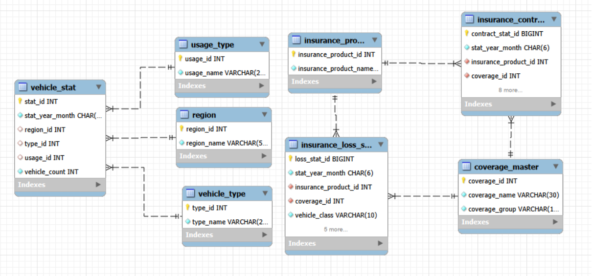
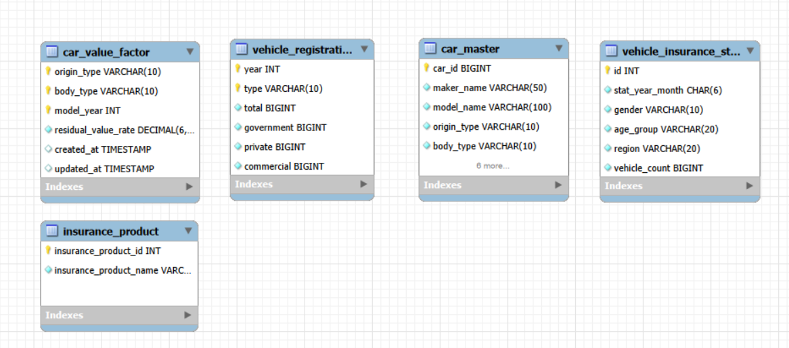

# 전국 자동차 등록 데이터와 보험 정보를 위한 모빌리티 데이터

> 연도별 자동차 등록 현황, 지역별 자동차 등록 현황, 전국 자동차 등록 현황 조회, 성/연령별 자동차 등록현황, 자동차 보험 계산 기능, 차종별 보험 가입 현황, 보험사별 FAQ
> 본 문서는 프로젝트 진행 상황에 맞춰 **지속적으로 업데이트**됩니다.

<br>

## 📌 프로젝트 한눈에 보기
    
  - **프로젝트명**: 전국 자동차 등록 데이터와 보험 정보를 위한 모빌리티 데이터
  - **진행 기간**: 2026.03.24 ~ 2026.03.31 (7일간)
  - **팀명**: 영4팀
  - **핵심 목표**
    - 전국 자동차 등록 현황 조회
    - 예상 보험료 계산 
    - 보험 관련 FAQ 조회
    - Streamlit 기반 통합 정보 서비스 구현

## 📎 발표자료

[PDF] (./docs/Team4 Driver Insight.pdf)

## 👥 팀 소개

### 1) 팀명
## 영4팀


### 2) 팀원소개

| 이름 | 한 줄 소개 |
|:---|:---|
| 양정현 | 차량 등록 현황 데이터 베이스 생성, Streamlit 취합           |
| 최원빈 | Backend - 보험 정보 데이터 전처리 및 데이터 베이스 생성발표   |
|  정승  | Backend - FAQ 크롤링, FAQ Streamlit 생성 및 발표         |
| 송민지 | Frontend 구조 생성, UI,PT 제작                           |


## 📖 프로젝트 개요
### 1) 프로젝트 주제
**전국 자동차 등록 데이터와 보험 정보를 위한 모빌리티 데이터**

### 2) 프로젝트 배경
자동차 등록 데이터와 보험 정보는 공공 데이터로서 활용 가치가 높으며, 
이를 기반으로 한 데이터 분석 및 정보 제공 서비스를 구현하고자 했습니다。

## 🎯 프로젝트 목표

### 주요 목표
1. **전국 자동차 등록 현황**
   - 지역별, 성/연령별, 연도별 로 조회 가능하도록 구성

2. **보험료 예상 금액 계산**
    - 연식, 나이, 성별, 모델명, 제조사, 국산/외산으로 보험료 예상 금액 계산 기능 

3. **보험사별 FAQ 제공**
   - DB, 삼성, 현대 FAQ의 정보를 쉽게 조회 가능하도록 구성

### 확장 목표
- 전국 자동차 등록 현황을 검색 할 수 있는 기능 추가
- 지역별 TOP5 등록 현황을 확인할 수 있는 지도 추가

### 학습 목표
- 공공데이터 수집 및 전처리
- MySQL 기반 데이터베이스 설계 및 적재
- Streamlit 기반 데이터 서비스 구현
- 지도 API 연동 및 시각화 경험

## 🗂 프로젝트 구조 
```bash
🚘 project/
├─ .env                         # API 키, DB 비밀번호 등 민감한 환경변수
├─ .gitignore                   # Git 추적 제외 파일 목록
├─ .README.md                   # 프로젝트 소개 및 실행 가이드
├─ .main.py                     # 프로젝트 자동차등록현황 + CSS + 보험료 계산
├─ .faq.py                      # 보험사별 FAQ 조회
├─ data/
│  ├─ 2026년_02월_자동차_등록자료_통계 (1).xlsx
│  ├─ db손해보험FAQ.xlsx
│  ├─ eco_car_table_with_attribute.xlsx
│  ├─ imported_car_table_with_attribute.xlsx
│  ├─ korean_car_table_with_attribute.xlsx
│  ├─ 삼성화재_FAQ (1).xlsx
│  ├─ 자동차보험_계약정보_전체_2023_2025.xlsx
│  ├─ 잔가율.xlsx
│  ├─ 현대해상_FAQ_209건_정리 (1).xlsx
├─ database/
│  ├─ car_db.sql
│  ├─ car_master.ipynb
│  ├─ car_value_factor.ipynb
│  ├─ coverage_master.ipynb
│  ├─ insurance_contract_stat.ipynb
│  ├─ insurance_loss_stat.ipynb
│  ├─ insurance_product.ipynb
├─ 크롤링/
│  ├─ db_faq.ipynb
│  ├─ hyundai_faq.ipynb
│  ├─ samsung_faq.ipynb
├─ docs/
│  ├─ images/
│  │  ├─ 화면구현 1.png
│  │  ├─ 화면구현 2.png
│  │  ├─ 화면구현 3.png
│  │  ├─ 화면구현 4.png
│  │  ├─ 화면구현 5.png
│  │  ├─ 화면구현 6.png
│  │  ├─ 화면구현 7.png
│  │  ├─ 화면구현 8.png
│  ├─ car.db.png            #ERD 
│  ├─ car_insurance_db.png  #ERD
│  ├─ car_insurance_db2.png  #ERD


```
### 🏞️ ERD



- 관계있는 모든 엔터티는 1:N 비식별 관계입니다.


### 자료 출처

[국가데이터처] https://stat.molit.go.kr/portal/cate/statView.do?hRsId=58&hFormId=5498&hSelectId=5498&sStyleNum=2&sStart=202602&sEnd=202602&hPoint=00&hAppr=1&oFileName=&rFileName=&midpath=https://kosis.kr/statHtml/statHtml.do?

[공공교통누리] https://stat.molit.go.kr/portal/cate/statView.do?hRsId=58&hFormId=5498&hSelectId=5498&sStyleNum=2&sStart=202602&sEnd=202602&hPoint=00&hAppr=1&oFileName=&rFileName=&midpath=

[공공데이터포털] https://www.data.go.kr/data/15133183/fileData.do#/tab-layer-file

[공공데이터포털] https://www.data.go.kr/data/15124891/openapi.do


## 🙌🏻 프로젝트 결과 

---
- 테스트/ 시연 이미지 삽입

| 연도별 자동차 등록현황 |
|  |
| 연도별 자동차 등록 현황을 한눈에 확인할 수 있는 메인 분석 화면입니다. 2021 ~ 2025년 차량등록 현황을 테이블과 차트로 확인 가능합니다. |

| 지역별 자동차 등록현황 |
|  |
| 각 지역별 자동차 등록 현황을 한눈에 확인할 수 있는 화면입니다. 각 지역별 가장 많이 등록한 지역을 지도로 확인 할수있고, 지역별 차트와 테이블로 확인 가능합니다. |

| 성/연령별 자동차 등록현황 |
|  |
| 성/연령별 자동차 등록 현황을 한눈에 확인할 수 있는 화면입니다. 연령별 자동차 등록현황을 차트와 테이블로 확인 가능합니다. |

| 지역별 차종별 자동차 검색 |
|  |
| 지역을 선택하고 차종을 검색해서 한눈에 확인할 수 있는 화면입니다. |

| 차종별 보험료 통계 현황 |
|  |
| 차종별 평균보험료를  한눈에 확인할 수 있는 화면입니다. 차트와 테이블로 확인 가능합니다. |

| 연령대별 보험료 통계 현황 |
|  |
| 연령대별 평균보험료를  한눈에 확인할 수 있는 화면입니다. 차트와 테이블로 확인 가능합니다. |

| 예상 보험료 계산 기능 |
|  |
| 나이, 성별, 연식, 국산/외산, 모델명, 제조사를 통해 예상 보험료를 확인하는 기능입니다. |

| 보험사별 FAQ |
|  |
| 현대, 삼성, DB 보험사별 FAQ를 확인할 수 있습니다. |

---

## 👏 첫 번째 프로젝트 소감

****

---
### 🐱 **양정현**
첫 프로젝트여서 어려운 과제였지만 다양한 기능을 사용하고 코드를 짜면서 성취감을 느낄 수 있는 경험이었습니다. 
짧은 시간이여서 아쉬움이 있지만 팀원들과 소통하면서 성장할 수 있는 계기가 되었습니다.

### 😊 **정승**
첫 크롤링 프로젝트에서 보안 이슈로 여러 번 막히며 어려움을 겪었지만, 그 과정에서 끈기와 문제 해결력을 키운 의미 있는 도전이었고, 
전직장 개발팀에게 조급하게 굴었던 점은 돌아보게 되었다.

### 👾 **최원빈**
보험료 산출에 대한 근거가 정해져있는 절대값이 없다보니 기준을 만드느라 많은 고민을 하였다. 차량, 연령, 
성별 외에도 참조할만한 데이터가 더 있었으면 정확도 높은 보험료 예측을 할 수 있었을 거 같다

### 👍🏻 **송민지**
스트림릿을 기반으로 시각화 구현을 수행하며 프론트 엔드 작업에 대해 실무적 이해도를 높일 수 있었다. 
팀원들의 도움으로 단순한 기능 구현을 넘어 데이터의 흐름과 구조를 이해하게 되었다.
